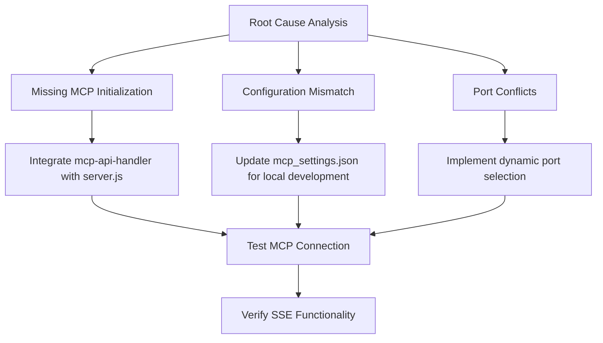

# MCP Connection Fix Plan

## Root Cause Analysis
1. **Missing MCP Initialization**: server.js lacks proper MCP server setup
2. **Configuration Mismatch**: mcp_settings.json uses Railway URL instead of localhost
3. **Port Conflicts**: Server running on port 8080 but may conflict with other services

## Solution Architecture

## Implementation Steps

### 1. Update server.js
- Import mcp-api-handler
- Initialize MCP server with proper configuration
- Add error handling for port conflicts
- Implement dynamic port selection

### 2. Fix mcp_settings.json
- Update URL to use localhost:8080/sse
- Validate JSON format
- Add environment-based configuration

### 3. Testing Plan
1. Verify Redis connection
2. Test SSE endpoint functionality
3. Check MCP tool availability
4. Validate both local and Railway deployments

### 4. Documentation
- Local development setup guide
- Railway deployment process
- Troubleshooting common issues

## Next Steps
1. Review this plan
2. Approve implementation
3. Switch to code mode for execution